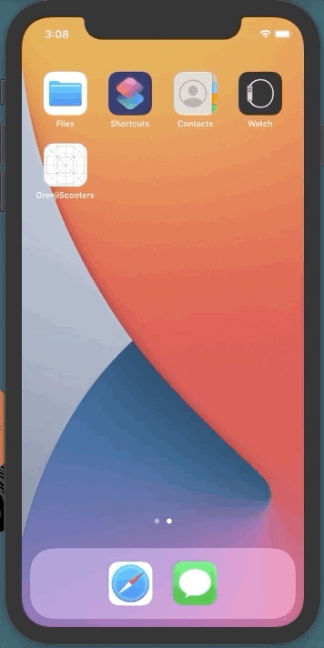
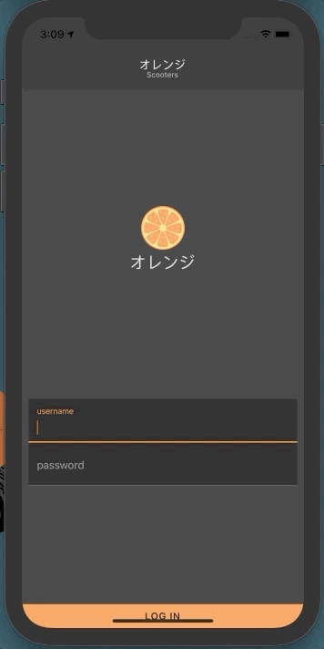
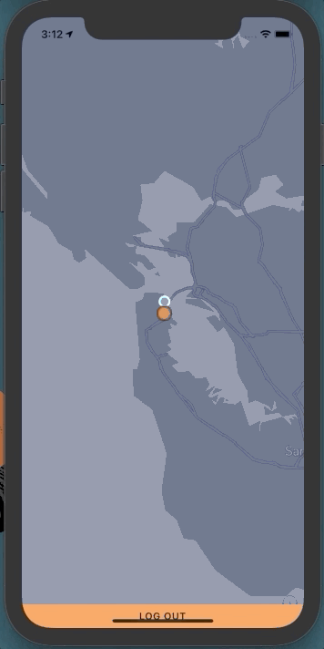
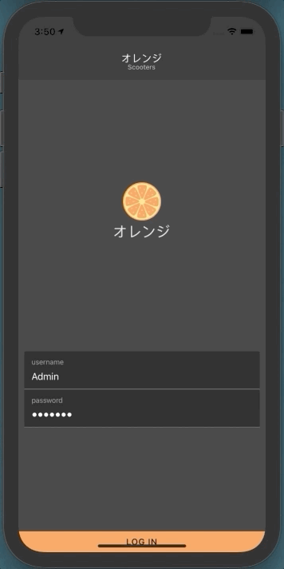
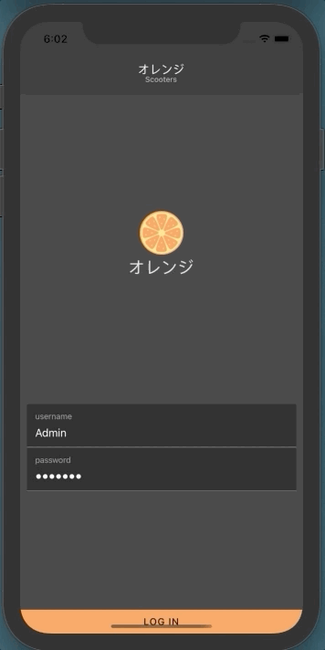

# オレンジ Scooters

A React Native application that displays a set of vehicles in a Mapbox view.

## Features

- **Login:** Initial page includes a login page for future implementation of user session support
    <br/>
- **Navigation:** Sreen navigation is supported for future addition of pages
    <br/>
    
- **Display vehicles:** Vehicles are loaded from REST API in Map (in GeoJSON format)
    <br/>
- **Vehicle Detail:** Vehicle metadata is displayed on vehicle selection
    - **Vehicle image:** 
        <br/>
    - **Vehicles status:**
        -  Available
        -  Rented
        -  Not Available
- **Error handling:** Main view handles errors through notification messages
    - **Network error:** Notification is displayed with "Retry" option
    <br/>
    - **Token error:** Label displaying Map was not able to load 
    <br/>


## Installation (ios only)

1. Follow the [React Native CLI Quickstart](https://reactnative.dev/docs/environment-setup) steps for the desired environment.
2. Clone the repository: 

    ```
    git clone https://github.com/emohedano/OrenjiScooters.git
    ```
3. Install progect dependencies:

    ```
    cd OrenjiScooters
    npm install
    cd ios && pod install
    ```
4. Setup and `.env` file (rename `sample.env`)
    - `BASE_URL`: Base URI from vehicles GeoJSON endpoint
    - `MAPBOX_TOKEN`: Mapbox Access Token
    - `MAPBOX_STYLE_URL`: URL from map style (private or public)

5. Start Metro server:

    ```
    npm run start
    ```
6. Build the app:

    ```
    npm run ios
    ```
7. Application should be running in virtual device

## Tests

Tu run the unit test simply run the following commands:

```
cd OrenjiScooters
npm run tests
```

## Folder structure

- **src:** Source code folder
    - **api:** Necessary resources for external API connection
        - **models:** Data models definitions
    - **components:** Reusable components definitions
    - **services:** Shared services of the application
    - **images:** App image resources
    - **navigation:** Navigation routing definition
    - **pages:** App Pages definition
    - **types:** Global types used in the App
- **screenshots:** Gifs containing screen interactions
- **sample.env:** File containing a placeholder for the environment variables needed 


## Additional Libraries
- [**react-navigation**](https://reactnavigation.org/)
    - Used to simplify navigation across screens
- [**react-native-config**](https://github.com/luggit/react-native-config)
    - Used to store private information in a `.env` file outside the repository
- [**react-native-paper**](https://callstack.github.io/react-native-paper/)
    - Used to provide consistent UI components
- [**@testing-library/react-native**](https://github.com/callstack/react-native-testing-library/)
    - Used to provide simplify testing of React components